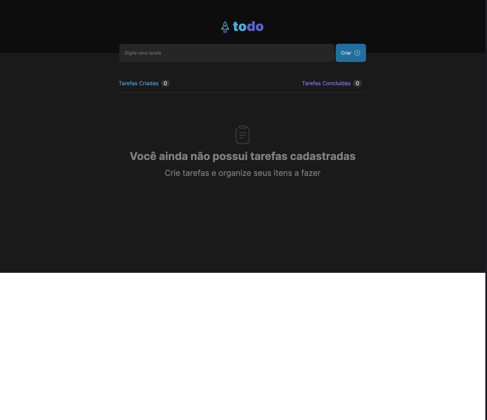
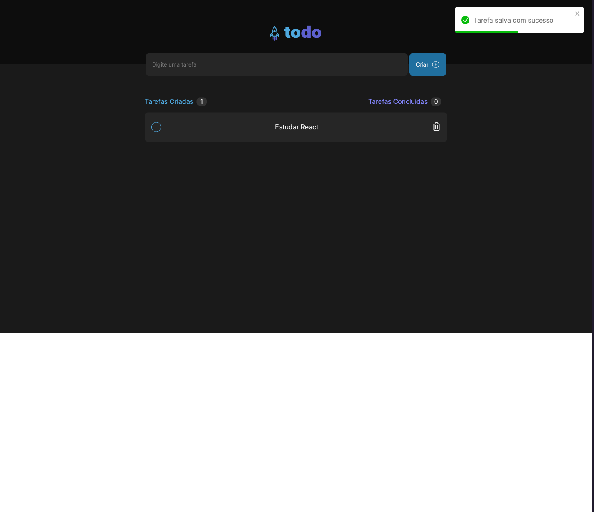
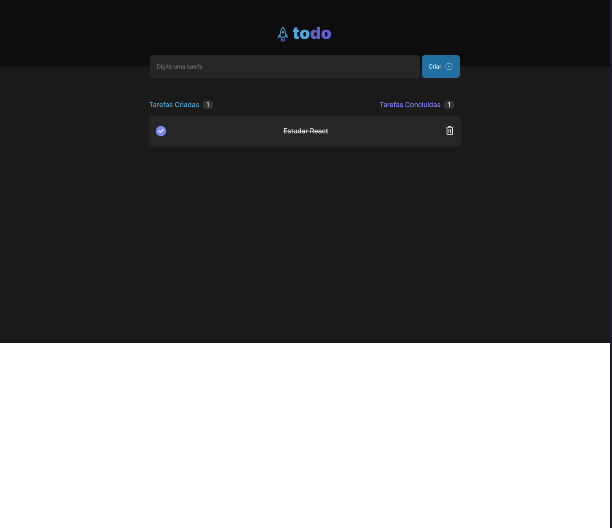

# 📸 Overview:




# 💻 Project:
## Aplicação Frontend que Cria, Deleta e Conclui tarfefas do dia a dia, salvando no localStorage.

# 🚀 Technologies:
### ✔️ NextJS
### ✔️ StitchesJS
### ✔️ Typescript
### ✔️ Local Storage


# How to run

```
# Clone this repository
$ git clone https://github.com/vinnycosta9898/ignite-todo

# Go to the directory
$ cd ignite-todo-app

# Install Dependencies
$ npm install

# Run Web Server
$ npm run dev